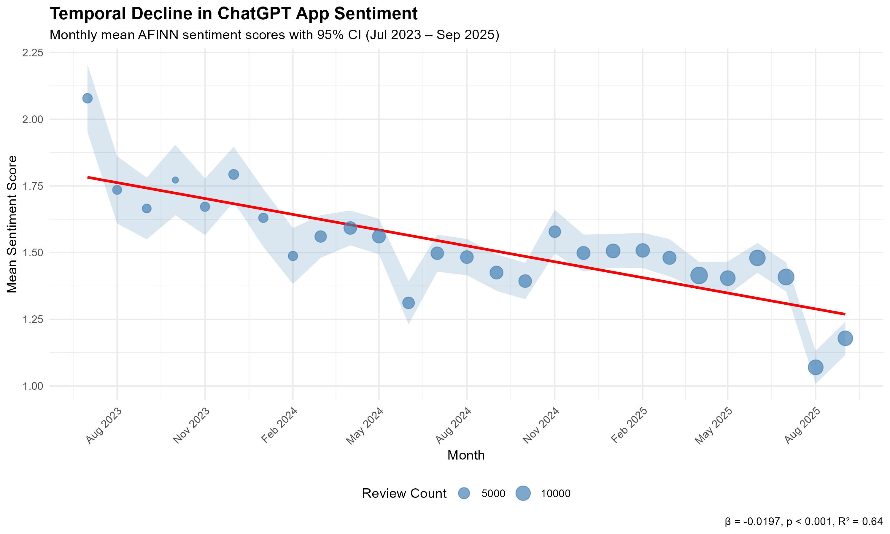
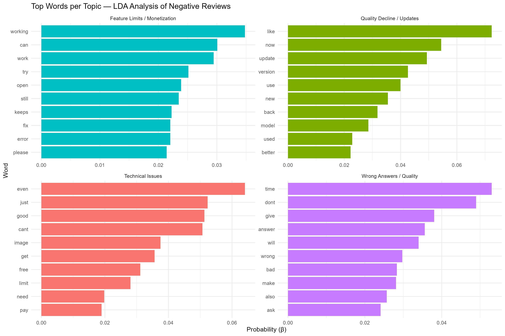

# Temporal Dynamics of User Sentiment: A Computational Analysis of ChatGPT App Reviews

**Hammad Mirza** · York University

## Overview

This project applies a mixed-methods computational approach to examine how user sentiment toward the ChatGPT Android app evolved across 27 months — from its Play Store launch in July 2023 through September 2025. Using 188,826 reviews scraped from the Google Play Store, we combine dictionary-based sentiment analysis, time series regression, one-way ANOVA, and LDA topic modelling to answer two research questions:

- **RQ1:** How has user sentiment, as expressed in review text, changed over time?
- **RQ2:** Do specific app versions trigger measurable sentiment shifts, and what themes dominate negative reviews?

**Key finding:** Text-based sentiment declined by **43.3%** over the study window (β = −0.0197, p < 0.001, R² = 0.640), while numerical star ratings remained statistically flat (β = −0.0031) — demonstrating that written review text captures a dimension of user dissatisfaction invisible to star-rating analysis alone.

---

## Results at a Glance

| Metric | Value |
|---|---|
| Raw reviews (source dataset) | 865,482 |
| Reviews after cleaning | 188,826 (21.8% retention) |
| Study period | July 2023 – September 2025 |
| Months covered | 27 |
| Sentiment trend β | −0.0197 (p < 0.001, R² = 0.640) |
| Sentiment: start → end | 2.08 (Jul 2023) → 1.18 (Sep 2025) |
| Sentiment decline | −43.3% |
| Star rating trend β | −0.0031 (flat) |
| Versions analysed (n ≥ 30) | 115 |
| ANOVA F-statistic | F(114) = 6.172, p < 2e-16 |
| LDA topics identified | 4 |

### Sentiment vs. Star Ratings Over Time



> Monthly mean AFINN sentiment scores with 95% confidence intervals (Jul 2023 – Sep 2025). The red regression line shows a statistically significant downward trend. Star ratings over the same period show virtually no trend (β = −0.0031) — a key divergence that motivates using text-based sentiment analysis alongside numerical ratings.

### LDA Topic Model — Complaint Themes in Negative Reviews



Topics were derived from 2,255 negative reviews (1–2 stars) from the worst-performing app versions, modelled against a vocabulary of 285 terms.

| Topic | Theme | Documents | Prevalence |
|---|---|---|---|
| 3 | Technical Issues | 735 | 26.2% |
| 4 | Wrong Answers / Quality | 730 | 26.0% |
| 1 | Feature Limits / Monetization | 690 | 24.6% |
| 2 | Quality Decline / Updates | 649 | 23.1% |

---

## Repository Structure

```
chatgpt-sentiment-analysis/
│
├── ChatGPT_Sentiment_Analysis.Rmd   # Main analysis — clean, fully reproducible
│
├── data/
│   └── chatgpt_reviews.csv          # Source data (see Data section below)
│
├── output/
│   ├── figures/                     # All generated plots (PNG, 300 DPI)
│   │   ├── RQ1_temporal_sentiment.png
│   │   ├── RQ1_star_ratings.png
│   │   ├── RQ2_topic_words.png
│   │   ├── word_frequency_top30.png
│   │   └── word_frequency_by_rating.png
│   ├── results/                     # Exported CSVs (monthly stats, version ranks, topics)
│   └── models/                      # Saved RDS model objects
│
└── README.md
```

---

## Methodology

### 1. Data Cleaning (9-step pipeline)
Raw reviews (865,482) were filtered through a sequential pipeline retaining 21.8% of records: removal of missing fields, minimum text length (20 chars), English-language detection via common-word heuristic, text normalisation (emoji/URL/HTML stripping), special-character ratio filtering (>50% stripped → excluded), spam pattern removal, gibberish detection (7+ consecutive consonants), deduplication, temporal bounding (Jul 2023 – Sep 2025), and rating validation (1–5 stars only).

### 2. Sentiment Analysis — AFINN Lexicon
Each review was tokenised and matched against the [AFINN lexicon](http://www2.imm.dtu.dk/pubdb/pubs/6010-full.html) (Nielsen, 2011), which assigns integer scores from −5 to +5 to 2,477 English words. Key negation words (`not`, `no`, `never`) were retained during stop-word removal. Per-review sentiment scores were summed from matched tokens (17.4% AFINN match rate; 64.3% of reviews contained at least one sentiment word). Reviews with no lexicon matches received a score of 0. Sentiment ordering was validated: Negative (−1.15) < Neutral (0.30) < Positive (2.02).

### 3. Temporal Trend Analysis (RQ1)
Monthly mean sentiment scores were regressed on a linear time index (month number 1–27) using OLS. A parallel regression on monthly mean star ratings served as a comparison baseline.

### 4. Version-Level ANOVA (RQ2, Part 1)
Mean sentiment was aggregated per app version for all 115 versions with ≥30 reviews. One-way ANOVA tested whether versions differ significantly in mean sentiment across 169,704 reviews. Effect size was computed as η² (eta-squared).

### 5. LDA Topic Modelling (RQ2, Part 2)
Negative reviews (1–2 stars) from versions in the bottom 10th percentile of sentiment were processed into a Document-Term Matrix (sparsity threshold: 0.99), yielding 2,255 documents × 285 terms. A 4-topic LDA model was fitted using Gibbs sampling (seed = 1234, `topicmodels` package). Topic labels were assigned manually based on the highest-probability terms per topic.

---

## Data

**Source:** [ChatGPT Reviews — Daily Updated](https://www.kaggle.com/datasets/ashishkumarak/chatgpt-reviews-daily-updated) (Kaggle, Ashish Kumar)

**Schema:**

| Column | Description |
|---|---|
| `reviewId` | Unique review identifier |
| `userName` | Reviewer name |
| `content` | Review text (→ `review_text` in pipeline) |
| `score` | Star rating 1–5 (→ `rating`) |
| `thumbsUpCount` | Community upvotes |
| `appVersion` | App version string (→ `version`; contains some nulls) |
| `at` | Review timestamp (→ `date`) |

> **Note:** This dataset is daily-updated. The analysis here uses a snapshot covering **July 25, 2023 – September 21, 2025** (865,482 raw reviews; 188,826 after cleaning). Results will differ if you download the dataset today and re-run the code. To reproduce exactly, filter the downloaded dataset to the above date range, or use the frozen snapshot in `data/chatgpt_reviews.csv` if included.

---

## How to Run

### Prerequisites

```r
install.packages(c(
  "tidyverse", "lubridate", "tidytext", "textdata",
  "tm", "topicmodels", "wordcloud", "RColorBrewer",
  "scales", "ggridges", "slam"
))
```

> On first run, `textdata::get_sentiments("afinn")` will prompt you to download the AFINN lexicon (~118 KB). Accept the prompt.

### Steps

1. Clone this repository
2. Place `chatgpt_reviews.csv` in the project root (same folder as the `.Rmd`)
3. Open `ChatGPT_Sentiment_Analysis.Rmd` in RStudio
4. Click **Knit → Knit to HTML** (recommended), or run chunks sequentially

All output figures and CSV results are written automatically to `output/figures/` and `output/results/`.

---

## Key Findings

**The star rating / sentiment divergence is the central result.** Over 27 months, numerical star ratings showed virtually no trend (β = −0.0031), while text-based AFINN sentiment declined by 43.3% (β = −0.0197, p < 0.001, R² = 0.640). This gap suggests users continue to award moderate ratings while their written commentary grows measurably more negative — an early-warning signal that star-rating monitoring alone would miss entirely.

Version-level ANOVA confirmed that the decline is not uniformly distributed: F(114) = 6.172, p < 2e-16, indicating highly significant differences in mean sentiment across the 115 versions analysed. LDA topic modelling of 2,255 negative reviews from the worst-performing versions reveals four near-equally distributed complaint themes. Technical issues (26.2%) and wrong/hallucinated answers (26.0%) are the most prevalent, followed closely by monetization friction (24.6%) — complaints about paywalls, feature limits, and the Plus subscription tier — and quality regression after updates (23.1%). The near-equal distribution across all four themes suggests broad-based dissatisfaction rather than a single dominant pain point.

---

## Limitations

- **Android only** — iOS App Store reviews may reflect a different user demographic and sentiment trajectory
- **Selection bias** — reviews represent motivated users; the median passive user is not captured
- **AFINN limitations** — the lexicon does not handle negation ("not good"), sarcasm, or AI-specific jargon; the 17.4% token match rate means most sentiment signal comes from explicitly valenced words
- **LDA topic count** — k=4 was chosen based on interpretability; perplexity-based model selection was not formally applied
- **Correlation, not causation** — version-sentiment associations cannot be causally attributed without controlled release data

---

## References

- Almansour, A., Alotaibi, R., & Alharbi, H. (2022). Text-rating review discrepancy (TRRD): An integrative review and implications for research. *Future Business Journal, 8*(1), 11. https://doi.org/10.1186/s43093-022-00114-y
- Khalid, H., Shihab, E., Nagappan, M., & Hassan, A. E. (2015). What do mobile app users complain about? *IEEE Software, 32*(3), 70–77. https://doi.org/10.1109/MS.2014.50
- Li, X., Zhang, B., Zhang, Z., & Stefanidis, K. (2020). A sentiment-statistical approach for identifying problematic mobile app updates based on user reviews. *Information, 11*(3), 152. https://doi.org/10.3390/info11030152
- Nielsen, F. Å. (2011). A new ANEW: Evaluation of a word list for sentiment analysis in microblogs. *Proceedings of the ESWC Workshop on Making Sense of Microposts*, 93–98.
- Pagano, D., & Maalej, W. (2013). User feedback in the AppStore: An empirical study. *2013 21st IEEE International Requirements Engineering Conference (RE)*, 125–134. https://doi.org/10.1109/RE.2013.6636712

---

## Authors

**Hammad Mirza** MA candidate, Information Systems & Technology, York University
[GitHub](https://github.com/hammadmirza)
